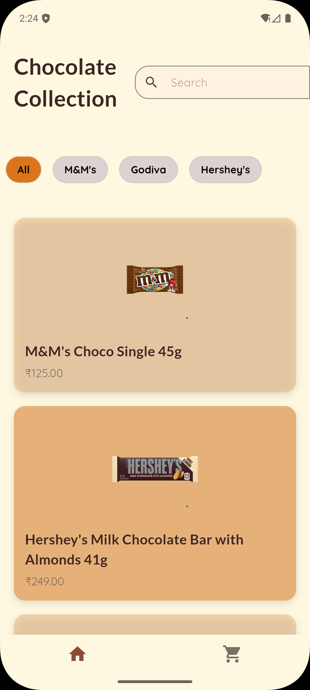
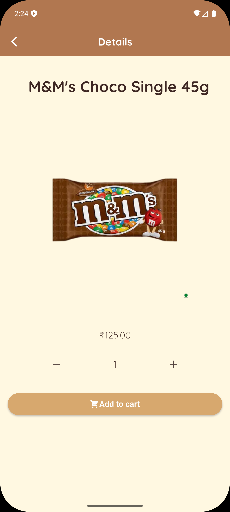
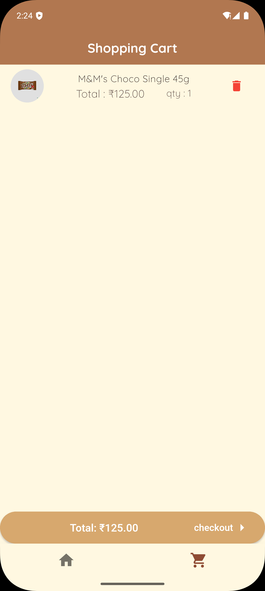

# 🛒 Chocolate Shopping App (Flutter)

A visually appealing and fully functional chocolate-themed shopping app built with Flutter. This app allows users to browse chocolate products, view details, add them to the cart, and simulate checkout. Built with `Provider` for state management and designed with a cozy chocolate-inspired theme.

---

## ✨ Features

- 🍫 **Product Listing**: Dynamic listing of chocolates using `ListView` with category filters and search functionality.
- 🔍 **Search & Filter**: Real-time search by name and filter by brands like M&M's, Hershey's, etc.
- 🛍️ **Product Details**: Beautiful detailed view with quantity selector and real-time price calculation.
- 🛒 **Cart Page**: Add/remove chocolates to cart, view totals, and delete with confirmation dialogs.
- 💡 **Splash Screen**: Lottie animated chocolate splash screen with smooth transition.
- 🌟 **Theme**: Custom rich chocolate UI with creamy background using Material 3 and Quicksand font.
- 📦 **State Management**: Powered by `Provider` (`CartProvider`) for managing cart operations.
- 📱 **Responsive UI**: Built with adaptability and mobile-first design in mind.

---

## 📸 Screenshots

| Home | Details | Cart |
|------|---------|------|
|  |  |  |

---

## 🧠 Tech Stack

- **Flutter (Material 3)**
- **State Management**: Provider
- **UI Design**: Lottie animations, Chip Filters, Theming
- **Font**: Quicksand

---

## 🗂 Folder Structure

```
shopping_app/
├── lib/
│   ├── main.dart
│   ├── pages/
│   │   ├── cart.dart
│   │   ├── details_page.dart
│   │   ├── home.dart
│   │   └── splash.dart
│   ├── providers/
│   │   └── cart_provider.dart
│   ├── widgets/
│   │   ├── product_card.dart
│   │   ├── global_variables.dart
│   │   └── shopping_app_frontscreen.dart
├── assets/
│   ├── images/ (product images)
│   ├── screenshots/ (light.jpeg, dark.jpeg)
│   └── animations/Chocolate.json
```
---

## 🚀 Getting Started

```bash
flutter pub get
flutter run
```
---
🌱 Future Scope
	•	✅ Add real payment gateway integration (e.g., Razorpay or Stripe)
	•	✅ Firebase/SQLite for real product database
	•	✅ User login & cart persistence
	•	✅ Animated transitions and smoother UI interactions
	•	✅ Wishlist & Favorites section
	•	✅ Admin panel to manage chocolates dynamically

⸻

👨‍💻 Author

Made with ❤️ by Varaprasad T
